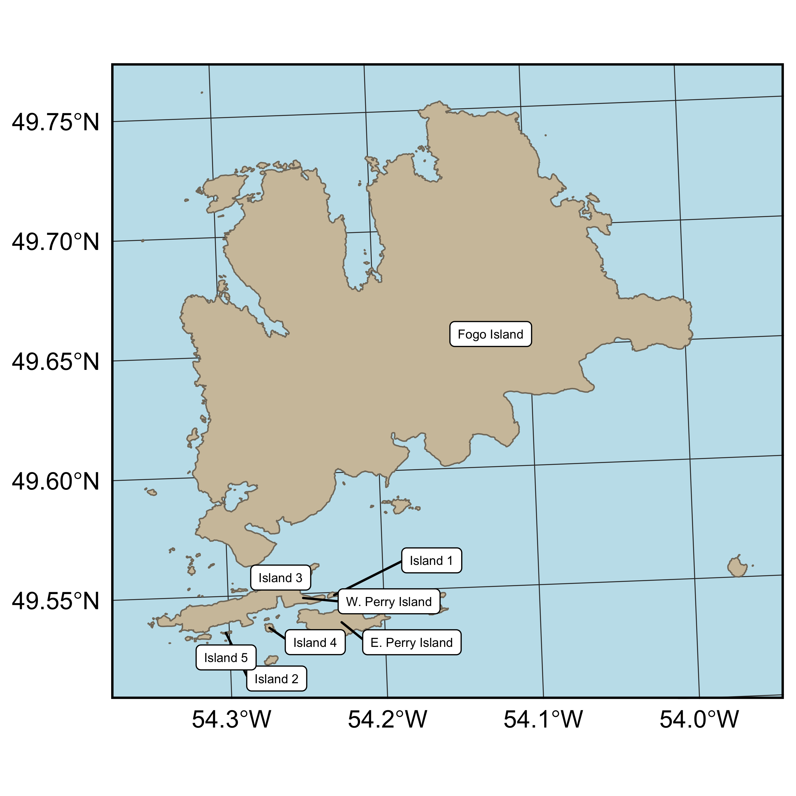

```{r knitropts, include = FALSE}
knitr::opts_chunk$set(
  echo = FALSE,
  eval = TRUE,
  fig.align = 'center'
)
```


```{r pkgs}
library(data.table)
library(ftExtra)
DT <- readRDS('../output/islandsPoly-with-label.Rds')
setDT(DT)
```

\newpage


```{r}

```


Figure S1: Map of the Fogo Island archipelago. `r DT[!is.na(label), .N]` islands are identified and the dominant habitats on these islands are presented in Table S1. Note, numbered islands do not have official names and for ease of interpretation we identified them using numbers.


\newpage

```{r}
prop <- readRDS('../output/fogo-prop-lc.Rds')[, .(
  Island = label, 
  `Area (km2)` = as.numeric(round(area / 1e+6, digits = 3)),
  Lichen = `Lichen and Heath`,
  Wetland,
  `Conifer forest` = `Conifer Forest`,
  `Rocky barrens` = `Rocky Barren`,
  Freshwater = Water,
  Other = Other
)]
mkpercent <- colnames(prop)[-c(1, 2)]
prop[, (mkpercent) := lapply(.SD, function(x) scales::label_percent(0.01)(x)), .SDcols = mkpercent]
```

```{r}
library(flextable)
ft <- qflextable(prop[order(-`Area (km2)`)])
set_caption(ft,
            'Summary of primary habitat types for eight islands in the Fogo Island Archipelago. Habitat types were determined using supervised classification of Landsat 7 imagery (Integrated Informatics Inc., 2014). Habitats pooled in the ‘other’ category include broadleaf forest, mixed-wood forest, and anthropogenic habitats and we pooled conifer forest and conifer scrub together as these habitats are similar in their species composition. Descriptions of each habitat type and dominant plant species are presented in Table S2 and the location of each island is presented in Figure S1.')
```


\newpage

```{r}
ft2 <- flextable(fread('../paper/tabs2.csv'))

set_caption(autofit(
  colformat_md(ft2)),
  caption = 'Summary of common plant species and groups of species in four habitat types on Fogo Island, Newfoundland. Habitat types were determined using supervised classification of Landsat 7 imagery with 30×30m pixels to generate land cover classifications (Integrated Informatics Inc., 2014).'
)
```

\newpage

**References**


Integrated Informatics Inc. 2014. Sustainable Development and Strategic Science Branch Land cover classification. Sustainable Development and Strategic Science, Government of Newfoundland and Labrador, St. John’s, NL.