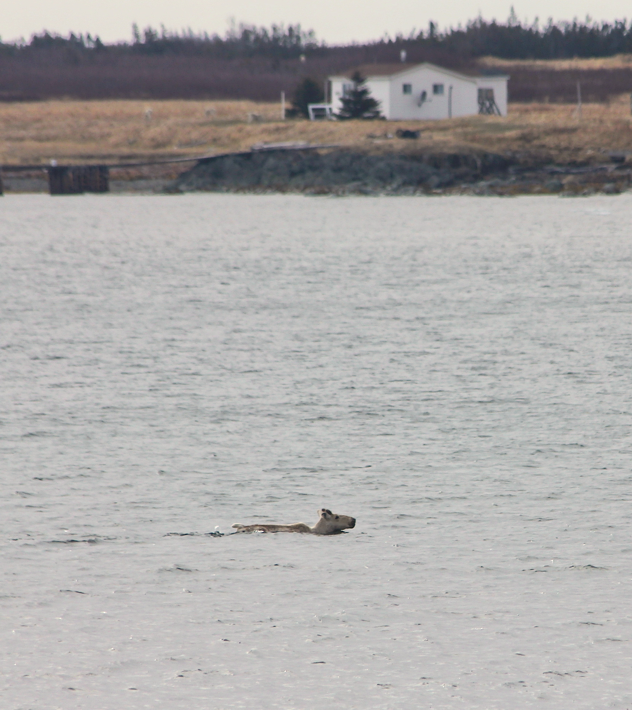

```{r knitropts, include = FALSE}
knitr::opts_chunk$set(echo = FALSE,
                      eval = TRUE,
                      fig.align = 'center')
```


```{r pkgs}
library(data.table)
```


```{r input}
edges <- readRDS('../output/island-edges.Rds')
icefree <- edges[season == 'icefree']
```


```{r summary-stats}
## Only icefree
# Number of events
nevents <- icefree[, .N]

# Number of individuals
nids <- icefree[, uniqueN(ANIMAL_ID)]

# Number of events by individual
neventid <- icefree[, .N, ANIMAL_ID]

# Max per individual
neventidMax <- max(neventid$N)

# Mean per individual
neventidMedian <- round(median(neventid$N))

# Min per individual
neventidMin <- min(neventid$N)

# IDs > 10 swimming
n10 <- length(icefree[, .N, ANIMAL_ID][N > 10]$N)

# Duration of time per island
dur <- round(icefree[, mean(islandlen)], digits = 0)
durMin <- round(icefree[, min(islandlen)], digits = 0)
durMax <- round(icefree[, max(islandlen)], digits = 0)

# Regular swimmers
ind <- edges[ANIMAL_ID == "FO2016011" | ANIMAL_ID == "FO2017001" | ANIMAL_ID == "FO2017013"]
indMean <- round(ind[, mean(islandlen)], digits = 0)

# Irregular swimmers
ind2 <- edges[ANIMAL_ID != "FO2016011" | ANIMAL_ID != "FO2017001" | ANIMAL_ID != "FO2017013"]
ind2Mean <- round(ind2[, mean(islandlen)], digits = 0)

## Full
# Number of events by individual + icefree season
nfull <- edges[, .N, .(ANIMAL_ID, season)]
```


\newpage

Movement is costly. Even for adept swimmers like caribou (*Rangifer tarandus*), which 
have hollow hair shafts that aid in flotation, the energetic expenditure of swimming 
for terrestrial mammals is markedly higher than walking or running (Miller and Gunn 1985). 
The drivers that promote the decision to swim for terrestrial mammals, like caribou, 
are often related to the profitability of forage (Miller et al. 1977) and the risks 
of predation (Jeffery et al. 2007, Jordan et al. 2010). The Fogo Island archipelago, 
off the coast of Newfoundland, Canada, is home to approximately 300 woodland caribou, 
descendants of 26 individuals introduced from the Island of Newfoundland to Fogo Island 
between 1964–67 (Bergerud and Mercer 1989). During fieldwork on May 30, 2017, we 
observed an unmarked adult male caribou swim between two smaller islands (Figure 1), 
a distance of 470 m which took approximately 9 minutes. Given that swimming is 
energetically expensive, we ask how often do caribou swim between islands, how 
long do they occupy islands, and ultimately what motivates swimming? Here, we 
frame swimming and island residency as a model of patch use as described by the 
marginal value theorem (Charnov 1976) within the context of the forage limitation 
hypothesis. For caribou, the forage limitation hypothesis refers to the 
constraints on food availability associated with changes in abundance (Klein 1991, 
Schaefer et al. 2016). Here, we integrate our understanding of forage limitation in
caribou populations by using island residency as a proxy for time in a patch and 
island size as a proxy for energy intake in a patch (Figure 2).

Forage limitation and over-grazing can reduce reproductive success of female caribou (Klein 1991, Schaefer et al. 2016). Forage scarcity has been proposed as a potential reason for caribou moving between arctic islands on the sea-ice in winter (Miller et al. 1977). We submit that testing the marginal value theorem could improve our understanding of forage limitation. The marginal value theorem posits that animals will forage optimally by depleting the resources in a given patch (i.e. island) before moving to a new patch (Charnov 1976). Depletion of resources on small islands could therefore mirror patterns of over-grazing and forage limitation that occur for caribou herds at higher densities in Newfoundland (Schaefer et al. 2016) and elsewhere in their range (Klein 1991).

Our focus on forage is due to the limited presence of predators in our system. Throughout their range, wolves (*Canis lupus*) are the primary predator of caribou. Because there are no wolves on the Island of Newfoundland, coyotes (*Canis latrans*) and black bears (*Ursus americanus*) are the majors predator of caribou (Lewis and Mahoney 2014). Within the Fogo Island archipelago there are no black bears and coyotes exist at low density (Huang et al. 2021), while the probability of coyote occurrence decreases on the smaller islands. The low density of predators throughout the archipelago is therefore an unlikely driver of swimming in our system, though predation may still influence swimming behaviour for caribou elsewhere in their range (e.g. Jeffery et al. 2007).

We identified swimming events as two consecutive GPS locations (2-hour relocation rates) on different islands (n = 29, for collaring details see Peignier et al. 2019). Newfoundland typically experiences pack ice in late winter and caribou may travel between islands by walking over the ice. We restricted our dataset between April 1 and December 31 to distinguish swimming from walking on ice. We calculated island residency as the duration of time, measured on 2-hour relocation rates, an individual caribou was observed on an island. Residency was therefore a proxy for when the benefits of foraging no longer exceeded the costs of swimming between islands. Our test of the marginal value theorem for the case of oceanic swimming by caribou is based on three assumptions: (1) resources are proportional to the size of each island above approximately 0.1km2; (2) caribou know the approximate value of the resources on an island before they swim to and from that island; and (3) the cost of swimming to and from an island is less than the value of resources on that island when the caribou departs. Should these assumptions hold, we would predict a positive relationship where caribou depart smaller islands sooner than larger islands.

Swimming behavior was common among GPS radio-collared caribou in the population (n = 29, for collaring details see Peignier et al. 2019). We identified `r nevents` swimming events over three years (Figure 2). In total, 13 of 29 collared female caribou swam among islands (Figure 2). Of the caribou that swam, caribou swam on average approximately `r neventidMedian` (range = `r neventidMin`-` neventidMax`) times per year and remained on each island for a median of `r dur` (range =  `r durMin`-`r durMax`) days before swimming again. We found that caribou residency increased proportionally with the size of the island for islands larger than approximately 0.1 km^2, such that caribou spent less time on smaller islands and more time on larger islands, providing preliminary evidence for links between forage limitation and the marginal value theorem (Figure 2B). In many cases, the smaller islands in the archipelago are forage limited and the larger islands provide greater opportunities to forage.

The apparent relationship between island size and residency creates a framework to test our 
assumptions about the marginal value of resource use by caribou. We extend this framework to test
prospective mechanisms that drive movement by caribou more generally, and swimming specifically. For
example:
1)	If caribou assess the relative value of resources in a patch, or on an island, we predict that residency should increase as the value of resources elsewhere becomes depressed. Longer relative residency might be an indicator of forage limitation and variation in residency could be a predictor of fitness costs and reduced reproductive success.
2)	Density-dependent habitat selection (Fretwell and Lucas 1969, Morris 2003) could be invoked to explain what drives caribou to swim and expand their ranges to include smaller islands. As caribou density increases on larger islands, competition for resources increases such that animals may have similar fitness benefits by selecting islands that at lower density would not be as profitable. At high local density, individual residency may decrease, thus, increasing the frequency of swimming. As such, density-dependent habitat selection may represent an ultimate explanation for why caribou swim between islands.
3)	Cognition is an important proximate mechanism that drives swimming behaviour. For example, caribou primarily rely on their sense of hearing and smell thus may not see or perceive an island when they enter the water to swim to it. How then do caribou know about the presence, and subsequently the value, of an island? Social and spatial cognition are almost certainly involved and tests of the role of cognition could help elucidate why caribou swim. For example, a novice individual may trust an experienced individual to lead them to a new island, a result which is driven by aspects of social cognition (Seyfarth and Cheney 2015). Meanwhile, once an individual has visited an island, it may become part of the cognitive map used to navigate within their home range (e.g. African elephants Loxondonta africana Presotto et al. 2019).

From our natural history observations and proximal movement data on caribou swimming, characteristics of destination islands, and residency on the islands, we have presented some evidence for the marginal value of resources that may serve as evidence of forage limitation for caribou swimming between islands. Further investigation into the nuance of forage profitability, local density, and the role of both social and spatial cognition is needed. Here, we have proposed a thought exercise that integrates the marginal value theorem with novel natural history observations to explain swimming behavior for terrestrial animals and opens the door for future studies of caribou in our system and other island archipelagos inhabited by caribou.

**Acknowledgements**
We thank M. Laforge, M. Bonar, C. Hart, and R. Huang for help in the field. Logistical support was
provided by L. Bixby. We thank J. Schaefer and one anonymous reviewer as well as all members of the
Wildlife Evolutionary Ecology Lab for their comments on previous versions of this manuscript.
Newfoundland Wildlife Division including S. Moores, B. Adams, C. Doucet, W. Barney, and J. Neville for
logistical support in the field as well as help with data data collection and management. We thank T.
Bergerud and S. Mahoney for their vision in initiating much of the work on caribou in Newfoundland.
Funding for this study was provided by the Natural Sciences and Engineering Research Council (QMRW,
JGH, EVW). We respectfully acknowledge the territory in which data were collected and analyzed as the
ancestral homelands of the Beothuk, and the island of Newfoundland as the ancestral homelands of the
Mi’kmaq and Beothuk.

\newpage

(ref:fig1) Photograph of swimming unmarked adult male caribou (*Rangifer tarandus*) from Western 
Perry Island to Eastern Perry Island taken on 30 May 2017.

```{r, fig.cap = '(ref:fig1)', fig.width=4}

```

\newpage

(ref:fig2) A) Map of the Fogo Island archipelago with swimming events from 13 caribou between islands.
B) Correlation between area of an island (km2) and the residency in days an individual caribou spent
on that island (linear mixed effects regression with ID as a random effect: ß = 1.08, SE = 0.06; tdf =
177 = 17.5, p < 0.001). C) Inset of swimming events between small islands on the northern coast of
Fogo island. D) Inset of swimming events between islands on the southern coast of Fogo island. The
grey diamond represents the location we observed an adult male caribou swimming (see Figure 1). E)
Histogram displaying the frequency of swimming events throughout the year. Colors correspond to
individual caribou, which are consistent in all panels, and vertical black bars delineate the ice-free
season (April 1 to December 31).


```{r, fig.cap = '(ref:fig2)', fig.width=4}
knitr::include_graphics('../graphics/Fig2.png')
```

<!-- edit caption Fogo Island is the largest
island in the archipelago (237.71 km^2^), but there are at least three other
large islands: Western Indian (77.6 km^2^), Eastern Indian (38.7 km^2^) and
Change (XX km^2^) Islands, as well as numerous smaller islands, including
Blundon’s (1.18 km^2^), North Long (1.01 km^2^), South Long (0.48 km^2^), Kate’s
(1.64 km^2^), and Brother’s (1.59 km^2^) Islands. Habitats are similar across
the archipelago, consisting largely of coniferous and mixed forests of balsam
fir (*Abies balsamea*), black spruce (*Picea mariana*), and white birch 
(*Betula papyrifera*) as well as bogs, lakes, lichen and rocky
barrens.-->


\newpage


```{r tab1}
knitr::kable(readRDS('../output/table1.Rds'),
             caption = '')
```


\newpage

**Literature Cited**
