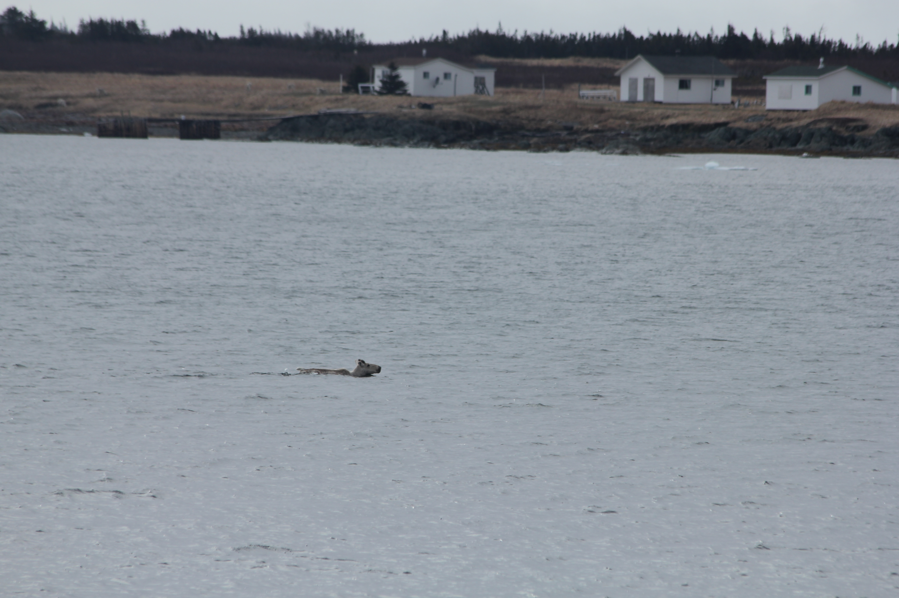

\newpage

**Introduction**

Caribou (*Rangifer tarandus*) are exceptional swimmers. Ample evidence exists
that caribou swim in streams, rivers, and lakes during migration [@Leblond2016],
to avoid predators [@Bergerud1985], and access islands during calving
[@Bergerud1990]. Even for adept swimmers like caribou, the energetic expenditure
of swimming for quadrupedal mammals is significantly higher than walking or
running, <!--[@Fish1993]--> and drowning is also possible [@Miller1985]. Despite
a large number of coastal and island caribou herds, only a handful of examples
have documented caribou swimming in the ocean [e.g. @Miller1995; @Miller2002;
@Jeffery2007; @Ricca2012].

The Fogo Island archipelago, off the coast of Newfoundland, Canada, is home to
approximately 300 woodland caribou. During routine fieldwork on May 30, 2017, we
observed an unmarked adult male caribou swim between Western and Eastern Indian
Islands (Figure 1), a distance of at least 470 m which took ~9 minutes (~52 m per
minute). This observation prompted us to investigate whether swimming behaviour
was common among GPS radio-collared caribou in the population (n = 29 adult
females; 1240g, GPS 4400M; Lotek Wireless Inc., Newmarket, Ontario, Canada). We
identified swimming events as two consecutive GPS (2-hour relocation rates)
locations from an individual occurred on different islands. Northeastern
Newfoundland typically experiences pack ice during winter and caribou are known
locally to travel between islands by walking over the ice. We restricted our GPS
data to the ice-free period of the year (April 1 - December 31) <!--confirm dates
--> and we identified three adult female caribou that collectively had 86
swimming events over three years (Figure 2). In addition to our own visual and
remotely sensed observations, residents of Fogo Island have also reported
observing caribou swimming between islands on numerous occasions.

<!-- add numbers in here -->
In total, these XX swimming events occurred throughout the ice-free season, with
a peak in November. On average, caribou swam between islands approximately ever
XX days, but some individuals swam up to XX times per week/month/whatever.
<!--Is it better
to just state our results here, or give this sort of teaser? Initially I had "86
events by 3 individuals" here, but then we ignore that for a couple paragraphs
of context before getting back into it... which seemed weird
QW: I agree. I've added some Fogo context-->

Caribou may swim between islands in the ocean for similar reasons that drive
caribou swimming in freshwater [@Leblond2016]. We propose that one such
explanation, the forage limitation hypothesis, is likely driving oceanic
swimming events [@Miller2002].

<!-- DO WE WANT TO CUT THIS? -->
Predation pressure is also known to affect caribou swimming behaviour, both in
immediate situations to escape predators [@Bergerud1990] and also pre-emptively
to give birth or raise calves in safer areas like isolated islands
[@Bergerud1985]. The Fogo Island archipelago does not contain historic caribou
predators such as wolves (*Canis lupus*) or black bears (*Ursus americanus*),
leaving coyotes (*Canis latrans*) as the top predator. Coyotes may predate
calves [@Rayl2014] but do not pose a substantial risk to adult caribou
[@Bastille-Rousseau2016]; predation in general does not exert as strong a force
on Fogo Island caribou as in mainland populations. Calves that are most
vulnerable to predation likely face a much higher energetic cost of oceanic
swimming than do adults, and indeed none of the females observed swimming had a
calf with them at the time.<!-- female-centric rather than time-of-year
["swimming events occurred in the weeks after calves were born"] seems better,
if we can confirm this--> Given the frequency of these swimming events, and that
swimming in the ocean with a calf-at-heel is riskier than other predator
avoidance strategies, we suspect that predation risk is not a main driver of
oceanic swimming in Fogo Island caribou.

Forage limitation and over-grazing is a major concern for caribou populations
[@Schaefer2016] and could explain movement between islands. Conspecific
competition for resources driven by reduced foraging opportunities can decrease
reproductive success of adult females [@Schaefer2016].Forage scarcity has been
proposed as a potential reason for caribou moving between arctic islands on the
sea-ice in winter [@Miller1977]. Caribou were introduced to Fogo Island (n = 26
animals between 1964–67) and Change Island (n = 5 animals in 1964) from
Newfoundland as part of a series of translocations and introductions throughout
the province (Bergerud & Mercer 1989). It is unknown when caribou began
colonizing nearby islands, but given that some are small, over-grazing by newly
arrived caribou may rapidly deplete forage [@Bergerud1990]. Although
unconfirmed, it is also possible that Fogo Island has experienced forage
depletion since the introduction of caribou in the 1960s. More likely, however,
is fine-scale competition for foraging resources that drives caribou to swim to
new islands.

Movement between islands requires caribou to assess the trade-off associated
with swimming. This trade-off can be understood as density-dependent habitat
selection governed by the Ideal Free Distribution [@Morris1987; @Bradbury2015].
Ideal Free Distribution theory predicts a fitness equilibrium: when the density
in a given habitat patch has exceeded the optimum for fitness within that patch,
animals should relocate and settle new habitat patches, so that fitness is equal
across all patches [@Bradbury2015]. Islands act as discrete habitat patches in
this case, but the costs associated with swimming create a trade-off when moving
between patches. For caribou in the Fogo Island archipelago, the role of forage
limitation in animal habitat selection patterns remains unknown, but swimming
between islands may in part be explained by forage limitation and conspecific
competition.

**Individual variation**

In total, 12 of 29 collared female caribou swam between islands in the Fogo
archipelago. Only 3 of these 12 had more than XX swimming events during the
study period, so approximately one third of our marked population swam
irregularly and infrequently, whereas for ~10% of individuals these swimming
events were relatively common, on average occurring once every 24 <!--confirm-->
days during ice-free seasons. We did not detect any swimming events for the
remaining 17 individuals; it remains unclear whether a subset of the population
does not engage in this behaviour at all, or whether these swimming events are
extremely rare for most caribou and we happened to detect some for those nine
individuals with very few observed swimming events. We are also unable to draw
conclusions about the prevalence of swimming in the ocean by male caribou: our
initial visual observation was of an adult male, but our GPS data only included
females.

<!-- "During the winter, when individuals could theoretically move between islands more easily by walking across ice, XX individuals were observed moving between islands. YY [(a) majority, (b) minority] of these were not detected swimming during the ice-free season and only moved between islands overwinter. This suggests that [(a) moving between islands is a relatively consistent behaviour within individuals, where some caribou refrain from both swimming and walking over ice] / [(b) caribou who avoided swimming between islands would still take advantage of the benefits provided by these patches, but only when travelling to them was less risky and costly] -->

<!-- QW: I'm not sure we need to say the below.. 
JGH - yeah, it's pretty extra I guess. I'm not really a fan of the above para either, it's not very convincing and doesn't add much
It is theoretically possible that these other
females moved rapidly back and forth between islands within the 2 hour fix rate
of our GPS collars, which we would be unable to detect. We consider this highly
unlikely given the range of residency times for caribou on any given island (min
- max: XX - XX). <!--double check-->
<!-- What is the typical residency time? Is this a true statement or am I just making this up? QW: this is something we will look into, I think. -->

Regardless, oceanic swimming is relatively common among a small minority of our
marked population. Of the three collared individuals, two were collared on
Western Indian Island and the third was collared on Fogo Island. Inter-island
distances between Western and Eastern Indian Islands, and the smaller islands
around them, are shorter than those between Fogo Island and others (Figure 2).
Individuals that were born on or spend more time on these smaller islands may
swim between them more frequently than animals that spend most of their time on
Fogo Island. The forage limitation hypothesis is generally thought to apply
uniformly across populations, but individual caribou could evaluate the costs
and benefits of swimming to another island differently. It is possible that some
individuals, in our case ~10%, considered swimming to be less costly or
perceived competition or predation more acutely than their conspecifics.

**Summary and conclusion**

For several decades after their introduction to Fogo Island, the caribou
population did not exceed ~100 individuals [@Bergerud1989, Newfoundland and
Labrador Wildlife Division, unpublished data]. During the 1990s, population
density reached 300 animals and anecdotal evidence suggests that [only then???]
caribou began to occupy other islands in the archipelago. We surmise that as
competition among conspecifics increased along with population size,
density-dependent habitat selection resulted in expansion of the population to
nearby islands. Following Ideal Free Distribution theory, caribou should swim to
new islands when the average fitness of individuals on the starting island
exceeds the density-fitness equilibrium [@Morris1987]. While this is an ultimate
explanation to a series of proximate observations, fine-scale density-dependent
habitat selection is theoretically possible [@Webber2018]. Given the presumed
low density of coyotes on Fogo Island and the minimal risk they pose to all but
young calves, who are least likely to engage in oceanic swimming, predation risk
does not appear to be a major driver of the behaviour in this system.
<!-- QW: changed it a bit - how is this? 
JGH: simplified these two para's a bit, took out most of the predator stuff. I'm a bit confused by the sentence above citing your 2018 paper, I'm not really sure what it's saying & how it relates to the rest of the section. there were comments to that effect as well, maybe expand the end a bit to make it clearer how that relates? -->

Our observations add to the evidence that caribou can, and occasionally do, swim
in the ocean [e.g. @Miller1995; @Miller2002; @Jeffery2007; @Ricca2012]. Taken
together, we suggest that swimming is likely more common than previously thought
for caribou living on oceanic islands, and that forage limitation and the
associated density-dependent habitat selection is an ultimate explanation for
this phenomenon. Although our inference is limited to observations, islands
appear to represent discrete foraging patches for terrestrial animals that can
influence fitness via increased foraging opportunities. We also posit that
individuals can vary in their evaluation of costs and benefits of movement
between these habitat patches.

**Acknowledgements**

We thank M. Laforge, M. Bonar, C. Hart, and R. Huang for help in the field.
Logistical support was provided by L. Bixby. We also thank members of the
Newfoundland Wildlife Division including S. Moores, B. Adams, C. Doucet, W.
Barney, and J. Neville for logistical support in the field as well as help with
data data collection and management. We thank T. Bergerud and S. Mahoney for
their vision in initiating much of the work on caribou in Newfoundland. Funding
for this study was provided by the National Sciences and Engineering Research
Council (QMRW, JGH, EVW). We respectfully acknowledge the territory in which
data were collected and analyzed as the ancestral homelands of the Beothuk, and
the island of Newfoundland as the ancestral homelands of the Mi’kmaq and
Beothuk.
<!-- Simplified the funding statement, do we need to name the specific scholarships/grants? Eric opinion??-->

\newpage

\captionsetup[figure]{labelformat=empty}

 

\newpage

\captionsetup[figure]{labelformat=empty}

<!--![**Figure 2**: Map of the Fogo Island archipelago. Fogo Island is the largest
island in the archipelago (237.71 km^2^), but there are at least three other
large islands: Western Indian (77.6 km^2^), Eastern Indian (38.7 km^2^) and
Change (XX km^2^) Islands, as well as numerous smaller islands, including
Blundon’s (1.18 km^2^), North Long (1.01 km^2^), South Long (0.48 km^2^), Kate’s
(1.64 km^2^), and Brother’s (1.59 km^2^) Islands. Habitats are similar across
the archipelago, consisting largely of coniferous and mixed forests of balsam
fir (*Abies balsamea*), black spruce (*Picea mariana*), and white birch 
(*Betula papyrifera*) as well as bogs, lakes, lichen and rocky
barrens.]()<!--(../graphics/IMG_1562.JPG)-->

\newpage

**Literature Cited**
