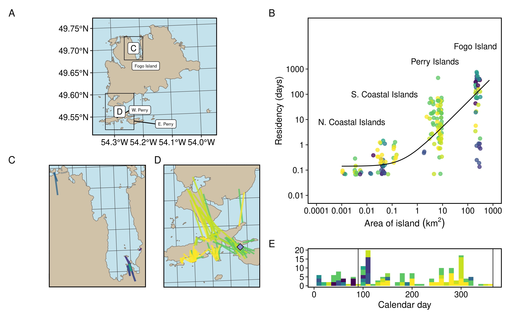

```{r knitropts, include = FALSE}
knitr::opts_chunk$set(echo = FALSE,
                      eval = TRUE,
                      fig.align = 'center')
```


```{r pkgs}
library(data.table)
```


```{r input}
edges <- readRDS('../output/island-edges.Rds')
icefree <- edges[season == 'icefree']
```


```{r summary-stats}
## Only icefree
# Number of events
nevents <- icefree[, .N]

# Number of individuals
nids <- icefree[, uniqueN(ANIMAL_ID)]

# Number of events by individual
neventid <- icefree[, .N, ANIMAL_ID]

# Max per individual
neventidMax <- max(neventid$N)

# Mean per individual
neventidMean <- round(mean(neventid$N))

# Min per individual
neventidMin <- min(neventid$N)

# IDs > 10 swimming
n10 <- length(icefree[, .N, ANIMAL_ID][N > 10]$N)

# Duration of time per island
dur <- round(icefree[, mean(islandlen)], digits = 0)
durMin <- round(icefree[, min(islandlen)], digits = 0)
durMax <- round(icefree[, max(islandlen)], digits = 0)

# Regular swimmers
ind <- edges[ANIMAL_ID == "FO2016011" | ANIMAL_ID == "FO2017001" | ANIMAL_ID == "FO2017013"]
indMean <- round(ind[, mean(islandlen)], digits = 0)

# Irregular swimmers
ind2 <- edges[ANIMAL_ID != "FO2016011" | ANIMAL_ID != "FO2017001" | ANIMAL_ID != "FO2017013"]
ind2Mean <- round(ind2[, mean(islandlen)], digits = 0)

## Full
# Number of events by individual + icefree season
nfull <- edges[, .N, .(ANIMAL_ID, season)]
```


\newpage

The Fogo Island archipelago, off the coast of Newfoundland, Canada, is home to
approximately 300 woodland caribou. During routine fieldwork on May 30, 2017, we
observed an unmarked adult male caribou swim between two small islands (Figure
1, see Figure 2 for location), a distance of at least 470 m which took ~9
minutes (~52 m per minute). This observation prompted us to investigate whether
swimming behaviour was common among GPS radio-collared caribou in the population
[n = 29, for collaring details see, @Peignier2019]. We identified swimming
events as two consecutive GPS locations (2-hour relocation rates)  from an
individual that occurred on different islands. Northeastern Newfoundland typically
experiences pack ice during winter and caribou are known locally to travel
between islands by walking over the ice. We restricted our GPS data to the
ice-free period of the year (April 1 to December 31) and identified `r nevents`
swimming events over three years (Figure 2). In addition to our own visual and
remotely sensed observations, residents of Fogo Island have also reported regularly
observing caribou swimming between islands.

In total, 12 of 29 collared female caribou swam between islands in the Fogo
Island archipelago. On average, caribou swam approximately `r neventidMean`
(range = `r neventidMin`-`r neventidMax`) times per year and remained on each
island for approximately `r dur` (range = `r durMin`-`r durMax`) days before
swimming again. Based on swimming data, we separated the population into three
apparent groups of individuals: those that swam regularly between islands (n =
3, every ~`r indMean` days); those that rarely engaged in swimming events (n =
9, every ~ `r ind2Mean` days); and those that never swam (n = 17).

Caribou (*Rangifer tarandus*) are exceptional swimmers. Ample evidence exists
that caribou swim in streams, rivers, and lakes during migration [@Leblond2016],
to avoid predators [@Bergerud1985], and to access islands during calving
[@Bergerud1990]. Even for adept swimmers like caribou, that have hollow hair
shafts that aid in flotation, the energetic expenditure of swimming for
quadrupedal mammals is significantly higher than walking or running, and
drowning is also possible [@Miller1985]. Despite the abundance of coastal and
island caribou herds, only a handful of studies have documented caribou swimming
in the ocean, and most of these lack observation, but rather deduce swimming
based on presence of caribou on a previously uninhabitated island  [e.g.
@Miller1995; @Miller2002; @Jeffery2007; @Ricca2012]. Caribou may swim between
islands in the ocean for similar reasons they swim in freshwater [@Leblond2016],
mainly concerning predator avoidance or movement between habitats. We propose
that one such explanation, the forage limitation hypothesis, is the most likely
explanation for oceanic swimming for caribou that live on islands in the Fogo
Island archipelago.

Caribou were introduced to Fogo Island (n = 26 animals between 1964–67) and
Change Island (n = 5 animals in 1964) from Newfoundland as part of a series of
translocations and introductions throughout the province [@Bergerud1989].
Typical caribou predators such as black bears (*Ursus americanus*) and wolves
(*Canis lupus*) are absent from Fogo Island; the dominant predator is coyote
(*Canis latrans*), which predate calves but it remains unclear what threat they
pose, if any, to adult caribou [@Rayl2014]. Given the minimal risk of predation to adults,
we propose that forage limitation is more likely to drive movement between
islands than predator avoidance. For several decades after their introduction to
Fogo Island, the caribou population did not exceed ~100 individuals
[@Bergerud1989, Newfoundland and Labrador Wildlife Division, unpublished data].
During the 1990s, population density reached ~300 animals; anecdotal evidence
suggests caribou were first seen on nearby islands during this same period.
Increased competition for resources on Fogo due to this increase in density
could have precipitated movement to other islands.

Forage limitation and over-grazing is a major concern for caribou populations
and can lead to reduced female reproductive success [@Schaefer2016]. Forage
scarcity has been proposed as a potential reason for caribou moving between
arctic islands on the sea-ice in winter [@Miller1977]. For the Fogo Island
population, as the population grew and predation pressure was insufficient to
maintain population density, forage depletion could lead caribou to make
similar, but riskier and more costly, movements between islands during the
ice-free season. Given the small size of other islands near Fogo, over-grazing
by newly arrived caribou could rapidly deplete forage on an annual cycle
[@Bergerud1990], leading to more frequent movements back and forth between
islands rather than permanent relocation.

The trade-off associated with swimming between islands can be understood as
density-dependent habitat selection governed by the Ideal Free Distribution
[@Morris1987; @Bradbury2015]. Ideal Free Distribution theory predicts a fitness
equilibrium: when the density in a given habitat patch has exceeded the optimum
for fitness within that patch, animals should relocate and settle new habitat
patches, so that fitness is equal across all patches [@Bradbury2015]. Islands
act as discrete habitat patches in this case, but the costs associated with
swimming create a trade-off when moving between patches. For caribou in the Fogo
Island archipelago, the role of forage limitation in habitat selection patterns
remains unknown, but swimming between islands may be at least partially governed
by density-dependent habitat selection.

Forage limitation may be the ultimate explanation for caribou swimming between
oceanic islands, but a number of proximate mechanisms remain untested. Our
observations of caribou swimming in the ocean to five questions for future
research:

1) How does the energetic cost or risk of swimming differ from walking on sea
ice? The cost of swimming may be lower than the risk of falling through sea ice
and drowning, so what proportion of inter-island movements are swimming events
compared to walking on ice? The presence and extent of sea ice varies annually
in our study area, and although we are unable to determine the exact timing or
duation of sea ice, we delineate on Figure 2b the timing of typical sea ice
arrival and departure.

2) At which temporal and spatial scales do caribou choose to swim
between islands? Does the time of day, weather, season, or availability
of food influence swimming?

3) Does reproductive status (presence of a calf-at-heel) or demographic class
(age, sex) influence propensity for oceanic swimming? Our initial observation
was of an adult male, but all collared individuals were adult females. Are
younger caribou more likely to swim due to heightened competition? Are males
more likely to swim in the summer given the are not restricted based on presence
of a calf-at-heel, as females are.

4) If swimming is a function of density-dependent habitat selection, what are
the costs of movement between patches? IFD assumes zero-cost movement, but could
the risk and energetic costs associated with oceanic swimming be estimated using
the potential fitness deficit that caribou are willing to tolerate before swimming to a
new island?

5) In relation to all the previous questions: how do individuals vary in their
assessment of the costs and benefits of swimming between islands? Why did some
caribou regularly engage in swimming events, while more than half of our marked
population were never observed swimming in the ocean? The forage limitation
hypothesis is thought to apply uniformly across populations, but
individual caribou could evaluate the costs and benefits of swimming to another
island differently. It is possible that some individuals, in our case ~10%,
considered swimming to be less costly or perceived competition or predation more
acutely than their conspecifics.

We surmise that for Fogo Island, as competition among conspecifics increased along with
population size, density-dependent habitat selection resulted in expansion of
the population to nearby islands. Following Ideal Free Distribution theory,
caribou should swim to new islands when the average fitness of individuals on
the starting island exceeds the density-fitness equilibrium [@Morris1987]. While
this is an ultimate explanation, our data suggest caribou only remain on smaller
islands for a few days at a time, so the fitness equilibrium remains a
theoretical construct. More likely, however, is that fine-scale competition,
density-dependent habitat selection, and forage depletion drives individuals to
periodically swim between islands. Our focal observations add to the evidence that caribou
can, and occasionally do, swim in the ocean [e.g. @Miller1995; @Miller2002;
@Jeffery2007; @Ricca2012]. We suggest that swimming is likely more common than
previously thought for caribou living on oceanic islands, and that forage
limitation and the associated density-dependent habitat selection is an ultimate
explanation for this phenomenon. Although our inference is limited to
observations, islands appear to represent discrete foraging patches for
terrestrial animals that can influence fitness via increased foraging
opportunities. We also present several hypotheses related to the nuances and
further variation within the idea that density-dependent habitat selection
governs swimming behaviour, and posit that above and beyond these additional
factors, individuals can vary in their evaluation of costs and benefits of
movement between these habitat patches.

**Acknowledgements**
We thank M. Laforge, M. Bonar, C. Hart, and R. Huang for help in the field.
Logistical support was provided by L. Bixby. We thank all members of the
Wildlife Evolutionary Ecology Lab, including C. Hart, C. Prokopenko, J. Kennah,
J.W. Turner, and S. Boyle for their comments on previous versions of this
manuscript. Newfoundland Wildlife Division including S. Moores, B. Adams, C.
Doucet, W. Barney, and J. Neville for logistical support in the field as well as
help with data data collection and management. We thank T. Bergerud and S.
Mahoney for their vision in initiating much of the work on caribou in
Newfoundland. Funding for this study was provided by the National Sciences and
Engineering Research Council (QMRW, JGH, EVW). We respectfully acknowledge the
territory in which data were collected and analyzed as the ancestral homelands
of the Beothuk, and the island of Newfoundland as the ancestral homelands of the
Mi’kmaq and Beothuk.

\newpage

(ref:fig1) Photograph of swimming unmarked adult male caribou (*Rangifer tarandus*) from Western to Eastern Indian Island taken on 30 May 2017.

```{r, fig.cap = '(ref:fig1)', fig.width=4}
knitr::include_graphics('../graphics/IMG_1562_crop_edit.jpg')
```

\newpage

(ref:fig2) A) Map of the Fogo Island archipelago with swimming events between islands. B) Histogram displaying the distribution of swimming events throughout the year. Note, colours correspond to individual caribou. C) Inset of swimming events between small islands on the northern coast of Fogo island. D) Inset of swimming events between islands on the southern coast of Fogo island. Note, the grey diamond represents the location we observed an adult male caribou swimming (see Figure 1).


```{r, fig.cap = '(ref:fig2)', fig.width=4}

```

<!-- edit caption Fogo Island is the largest
island in the archipelago (237.71 km^2^), but there are at least three other
large islands: Western Indian (77.6 km^2^), Eastern Indian (38.7 km^2^) and
Change (XX km^2^) Islands, as well as numerous smaller islands, including
Blundon’s (1.18 km^2^), North Long (1.01 km^2^), South Long (0.48 km^2^), Kate’s
(1.64 km^2^), and Brother’s (1.59 km^2^) Islands. Habitats are similar across
the archipelago, consisting largely of coniferous and mixed forests of balsam
fir (*Abies balsamea*), black spruce (*Picea mariana*), and white birch 
(*Betula papyrifera*) as well as bogs, lakes, lichen and rocky
barrens.-->


\newpage

**Literature Cited**
